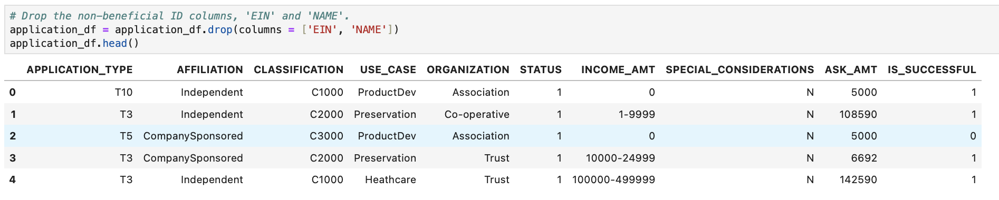
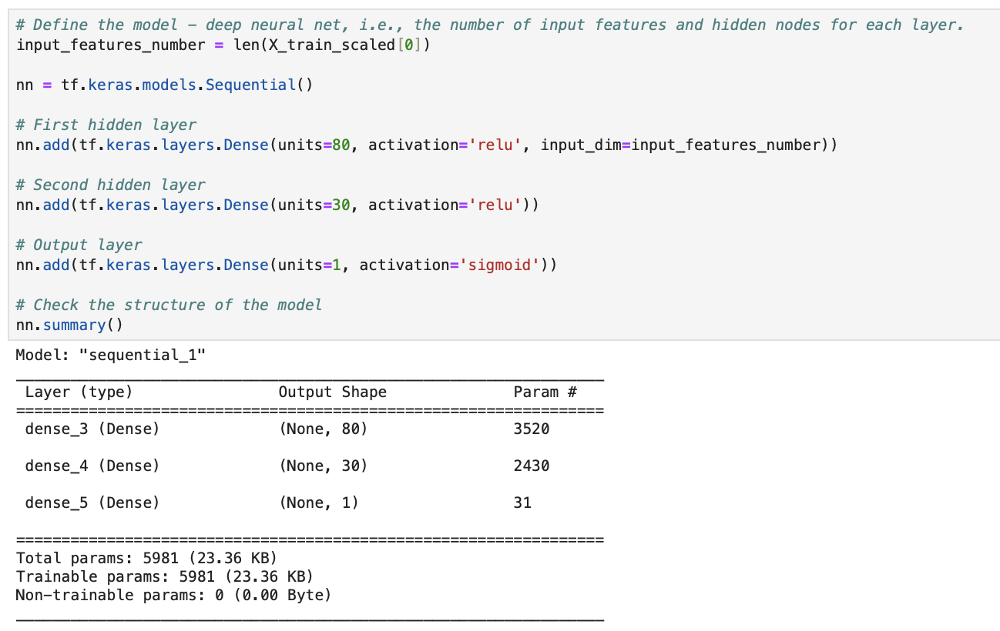

# Analysis Report

## Purpose of the Analysis

##### We created a tool for the nonprofit foundation Alphabet Soup to use to help them in selecting the applicants for funding with the best chanee of success in their ventures.

## Questions

### Data Preprocessing

#### What variable(s) are the target(s) for your model?

##### "IS_SUCCESSFUL" column in application_df

#### What variable(s) are the features for your model?

##### Every column in application_df other than "IS_SUCCESSFUL"

#### What variable(s) should be removed from the input data because they are neither targets nor features?

##### "EIN" and "NAME" columns

### Compiling, Training, and Evaluating the Model

#### How many neurons, layers, and activation functions did you select for your neural network model, and why?

##### I used a model with 3 layers: first hidden with 80 units and relu activation function; second hidden with 30 units and relu activation function; and output with 1 unit and sigmoid activation function. These seemed to be most optimal.

#### Were you able to achieve the target model performance?

##### No I was not able to achieve the target model performance.

#### What steps did you take in your attempts to increase model performance?

##### I was not able to take any more further steps.

## Summary

##### This model for deep learning proved to be about 73.5% accurate.

## Different Model

##### In order to achieve a higher level of accuracy, we could use a model with more of an interaction between the input and output data. We could produce this by cleaning up the dataframe further from irrelevant data.